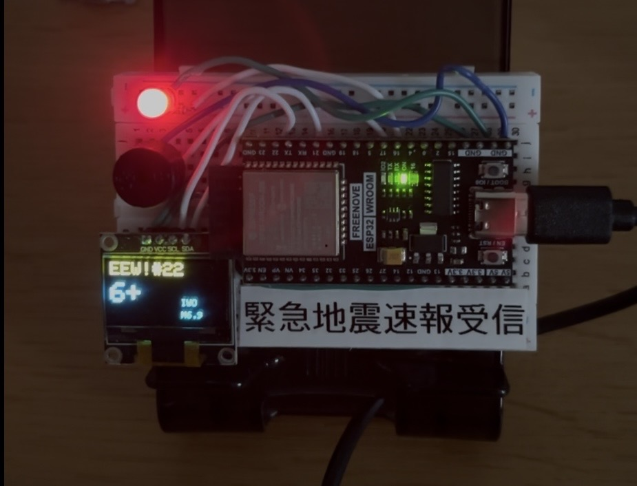
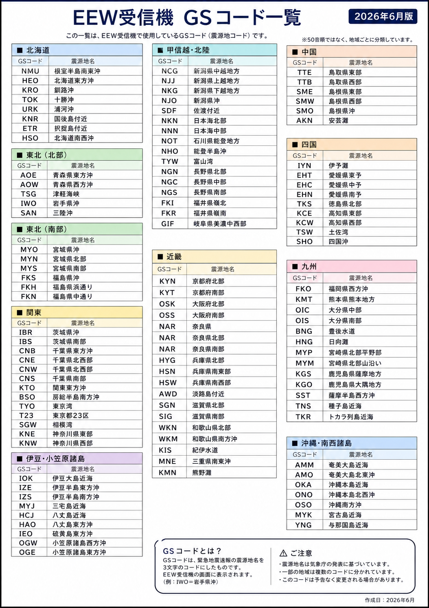

# ESP32 EEW Receiver

ESP32とOLEDディスプレイを使用した、緊急地震速報（EEW）受信モニターです。

## Screenshots



本機はWi-Fi経由でEEW情報を取得し、OLEDディスプレイへリアルタイムに表示します。警報時にはLEDとブザーで通知を行い、速報番号・最大予測震度・マグニチュード・震源GSコードなどを確認できます。

本プロジェクトは電子工作・防災・地震観測を目的とした個人製作のEEW受信機です。

> **⚠ Notice**
> この受信機は個人製作です。公式な緊急地震速報受信装置ではありません。防災判断には必ず気象庁などの公式情報をご利用ください。

---

# Features

* ESP32によるWi-Fi通信
* Wolfx JMA EEW API対応
* SSD1306 OLED（128×64）表示
* 約1秒間隔でEEW情報を取得
* 最大予測震度表示
* マグニチュード表示
* 震源GSコード表示
* PLUM対応
* FINAL報対応
* キャンセル報対応
* EventID・Serialによる速報管理
* LED警報
* パッシブブザー警報
* 全国震源GSコード対応

---

# Hardware

## Used Parts

| Part              | Product                            |
| ----------------- | ---------------------------------- |
| Development Board | Freenove ESP32 Dev Board Kit       |
| OLED Display      | ARCELIS SSD1306 0.96 inch OLED     |
| LED               | ELPA HK-LED5H (5mm)                |
| Buzzer            | 16Ω Passive Electromagnetic Buzzer |
| Breadboard        | Standard Breadboard                |
| Jumper Wires      | Male-Male Jumper Wires             |
| USB Cable         | USB Cable for ESP32                |

---

# Specifications

| Item            | Description                 |
| --------------- | --------------------------- |
| MCU             | ESP32                       |
| Display         | SSD1306 OLED 128×64         |
| Communication   | Wi-Fi                       |
| Power           | USB 5V                      |
| Update Interval | About 1 second              |
| Data Source     | Wolfx JMA EEW API           |
| Development     | Arduino IDE / Arduino Cloud |

---

# Overview

本機は以下の流れで動作します。

```text
Wolfx JMA EEW API
        │
        ▼
ESP32 Wi-Fi Communication
        │
        ▼
JSON Data Analysis
        │
        ▼
EEW Processing
        │
        ▼
OLED Display
        │
        ▼
LED & Buzzer Alert
```

---

# Main Functions

## Normal Standby

Wi-Fi接続後、約1秒間隔でEEW情報を取得します。

表示例

```text
WiFi OK

Waiting...
```

---

## EEW Reception

EEWを受信すると、

* 速報番号
* 最大予測震度
* 震源GSコード
* マグニチュード

をOLEDへ表示します。

表示例

```text
EEW!#12

6+
IWO   M6.9
```

---

## Alert

警報対象のEEWを受信した場合、

* LED点灯
* ブザー警報

を自動で実行します。

---

## Automatic Update

速報番号（Serial）が更新されるたびに表示内容も自動更新されます。

新しい地震（EventID変更）の場合も自動で切り替わります。

---
# Wiring

## Connection Diagram

```text
                    OLED SSD1306
              ┌──────────────────┐
              │ VCC GND SCL SDA │
              └─┬───┬───┬───┬────┘
                │   │   │   │
                │   │   │   └──────── GPIO21 (SDA)
                │   │   └──────────── GPIO22 (SCL)
                │   └──────────────── GND
                └──────────────────── 3.3V

                      ESP32 Dev Board
        ┌─────────────────────────────────────┐
        │                                     │
3.3V ───┤ 3V3                                 │
GND  ───┤ GND                                 │
SDA  ───┤ GPIO21 (SDA)                        │
SCL  ───┤ GPIO22 (SCL)                        │
LED  ───┤ GPIO16 ─────► LED (+)               │
BZ   ───┤ GPIO17 ─────► Passive Buzzer (+)    │
        │                                     │
        └─────────────────────────────────────┘
                         │
                         │
                    Common GND
```

---

## Connection Table

| ESP32 Pin | Connect To              |
| --------- | ----------------------- |
| 3.3V      | OLED VCC                |
| GND       | OLED GND                |
| GND       | LED (-)                 |
| GND       | Passive Buzzer (-)      |
| GPIO21    | OLED SDA                |
| GPIO22    | OLED SCL                |
| GPIO16    | LED (+) ※220Ω～330Ω抵抗を推奨 |
| GPIO17    | Passive Buzzer (+)      |

---

## Wiring Notes

* OLEDはI2C通信を使用します。
* LEDには220Ω～330Ω程度の電流制限抵抗を使用してください。
* すべてのGNDは共通に接続してください。
* GPIO16はLED、GPIO17はパッシブブザー専用です。

---

# Assembly

## Required Tools

* はんだ付け不要（ブレッドボードで動作）
* USBケーブル
* パソコン
* Arduino IDE または Arduino Cloud

---

## Assembly Procedure

### 1. ESP32をブレッドボードへ取り付けます。

---

### 2. OLEDを接続します。

接続先

* VCC → 3.3V
* GND → GND
* SDA → GPIO21
* SCL → GPIO22

---

### 3. LEDを接続します。

GPIO16から220Ω～330Ω程度の抵抗を経由してLEDのアノード（＋）へ接続します。

LEDのカソード（－）はGNDへ接続します。

---

### 4. ブザーを接続します。

ブザー（＋）をGPIO17へ接続します。

ブザー（－）はGNDへ接続します。

---

### 5. USBケーブルを接続します。

ESP32へUSBケーブルを接続すると起動します。

---

# Software

## Supported Environment

本プロジェクトは以下で開発できます。

* Arduino IDE
* Arduino Cloud

---

## Required Libraries

以下のライブラリをインストールしてください。

### Arduino Library Manager

* Adafruit GFX Library
* Adafruit SSD1306
* ArduinoJson

---

### Standard Libraries

ESP32環境に含まれています。

* WiFi
* WiFiClientSecure
* HTTPClient
* Wire

---

# First Boot

起動すると以下の画面が表示されます。

```text
BOOT
```

その後、自動でWi-Fiへ接続します。

接続成功すると、

```text
WiFi OK

Waiting...
```

が表示され、EEW情報の取得を開始します。

Wi-Fiへ接続できない場合は、

```text
NO WIFI
```

を表示し、接続を再試行します。

---
# Wi-Fi Configuration

初回使用前に、ESP32を使用するWi-Fiへ接続できるよう設定してください。

スケッチ内の以下の部分を書き換えます。

```cpp
const char* ssid = "YOUR_WIFI_SSID";
const char* password = "YOUR_WIFI_PASSWORD";
```

## Example

```cpp
const char* ssid = "HomeWiFi";
const char* password = "password123";
```

Wi-Fi設定を書き換えた後、ESP32へスケッチを書き込んでください。

> **⚠ Security**
>
> GitHubへ公開する場合は、自分のSSIDやパスワードを書いたまま公開しないでください。

---

# Upload

Arduino IDEまたはArduino CloudでESP32へスケッチを書き込みます。

## Arduino IDE

1. ESP32ボードパッケージをインストール
2. ESP32 Dev Moduleを選択
3. COMポートを選択
4. 書き込み（Upload）を実行

書き込み完了後、自動的にESP32が起動します。

---

# Internet Connection

起動後の動作

```text
Power ON
     │
     ▼
Wi-Fi Connection
     │
     ▼
HTTPS Connection
     │
     ▼
Wolfx API
     │
     ▼
JSON Download
```

約1秒ごとにEEW情報を取得します。

---

# Data Source

本プロジェクトでは以下のAPIを使用しています。

```text
https://api.wolfx.jp/jma_eew.json
```

取得したJSONデータをESP32で解析し、OLEDへ表示しています。

---

# Retrieved Data

主に以下のデータを使用しています。

| JSON Item    | Description |
| ------------ | ----------- |
| EventID      | 地震イベントID    |
| Serial       | 速報番号        |
| Hypocenter   | 震源名         |
| Magnitude    | マグニチュード     |
| MaxIntensity | 最大予測震度      |
| isWarn       | 警報かどうか      |
| isFinal      | 最終報かどうか     |
| isAssumption | PLUM報かどうか   |
| isCancel     | キャンセル報かどうか  |
| WarnArea     | 警報対象地域      |

---

# JSON Processing

取得したJSONデータはESP32内部で解析されます。

処理の流れ

```text
HTTPS Download
       │
       ▼
JSON Parse
       │
       ▼
Read Each Item
       │
       ▼
EEW Processing
       │
       ▼
OLED Update
```

ArduinoJsonライブラリを使用して各項目を読み取っています。

---

# Update Interval

通常時は約1秒ごとにAPIへアクセスし、新しいEEW情報を確認します。

新しい速報が発表されると、自動的に表示内容が更新されます。

通信に失敗した場合は、次回の取得タイミングで再度アクセスを行います。

---

# Displayed Information

EEW受信時には以下の情報を表示します。

* EEW種別（通常・PLUM・FINAL）
* 速報番号（Serial）
* 最大予測震度
* 震源GSコード
* マグニチュード

表示例

```text
EEW!#18

5+
SAN   M7.1
```

---
# EEW Processing

本機は約1秒ごとにWolfx JMA EEW APIへアクセスし、新しい緊急地震速報（EEW）が発表されているか確認します。

取得したJSONデータはESP32内部で解析され、速報の種類や更新状況を判定します。

---

# Processing Flow

```text id="apv0f9"
Power ON
    │
    ▼
Wi-Fi Connection
    │
    ▼
HTTPS Access
    │
    ▼
Download JSON
    │
    ▼
Parse JSON
    │
    ▼
Read EventID
Read Serial
Read Hypocenter
Read Intensity
Read Magnitude
Read Flags
    │
    ▼
Determine Update
    │
    ▼
OLED Update
    │
    ▼
LED / Buzzer Alert
```

---

# Event Management

本機では同じEEWを何度も処理しないように、

* EventID
* Serial

の2つを使用して管理しています。

---

## EventID

EventIDは地震ごとに割り当てられる識別番号です。

例

```text id="zj1khm"
20260701123456
```

新しいEventIDを受信した場合は、

* 新しい地震

として認識します。

---

## Serial

Serialは速報番号です。

例

```text id="z9n1ye"
EEW#1
↓

EEW#2
↓

EEW#3
↓

FINAL#4
```

速報番号が増えるたびに表示内容を更新します。

---

# Duplicate Prevention

内部では

* lastEventID
* lastSerial

を保存しています。

受信した情報と比較し、

* 新しい地震
* 続報

のみを処理します。

同じ速報を何度も表示することはありません。

---

# EEW Types

本機では3種類のEEWを判定しています。

---

## Normal EEW

通常の緊急地震速報です。

表示例

```text id="tbr2zc"
EEW!#12
```

---

## PLUM

PLUM法による速報です。

JSONの

```text id="2uz2mg"
isAssumption
```

を利用して判定します。

表示例

```text id="u4bjlwm"
PLUM#12
```

---

## FINAL

最終報です。

JSONの

```text id="a1r7uw"
isFinal
```

を利用して判定します。

表示例

```text id="xv52t2"
FINAL#12
```

最終報受信後も内容は保持され、その後待機画面へ戻ります。

---

# Alert Processing

LED・ブザーは以下の条件で動作します。

```text id="xknkqh"
新しいEEW
        または
速報更新
        ＋
警報対象
```

つまり、

* 新しいEEW
* 続報
* 警報（isWarn）

この3つの条件を満たした場合のみ警報します。

---

# LED

GPIO16へ接続したLEDを点灯します。

警報終了後は消灯します。

---

# Passive Buzzer

GPIO17へ接続したパッシブブザーを使用します。

現在の警報音は周波数スイープ方式です。

```text id="n3vwsd"
1000Hz
↓

2200Hz
↓

1000Hz
```

これを3回繰り返します。

---

# CANCEL Report

キャンセル報を受信した場合、

表示

```text id="k7m8lr"
CANCEL
```

へ切り替わります。

同時に

* LED消灯
* ブザー停止
* EventIDリセット
* Serialリセット

を実行します。

キャンセル画面は一定時間表示された後、待機状態へ戻ります。

---

# Communication Error

Wi-Fiへ接続できない場合は、

```text id="7vutbi"
NO WIFI
```

を表示します。

Wi-Fi接続が回復すると、自動的にEEW情報の取得を再開します。

---
# Display

本機では128×64 SSD1306 OLEDディスプレイへ地震情報を表示します。

画面は必要な情報だけを見やすく表示することを目的として設計しています。

---

# Normal Screen

通常時

```text
WiFi OK

Waiting...
```

この画面が表示されている間も、約1秒ごとにEEW情報を取得しています。

---

# EEW Screen

EEW受信時

```text
EEW!#12

6+
IWO     M6.9
```

---

# Screen Layout

```text
┌──────────────────────┐
│ EEW!#12              │
│                      │
│ 6+                   │
│                      │
│          IWO         │
│          M6.9        │
└──────────────────────┘
```

---

# Display Items

## First Line

速報種類と速報番号を表示します。

表示例

```text
EEW!#15
PLUM#8
FINAL#23
```

---

## Maximum Forecast Intensity

画面中央には最大予測震度を大きく表示します。

変換内容

| JMA | Display |
| --- | ------- |
| 1   | 1       |
| 2   | 2       |
| 3   | 3       |
| 4   | 4       |
| 5弱  | 5-      |
| 5強  | 5+      |
| 6弱  | 6-      |
| 6強  | 6+      |
| 7   | 7       |
| 不明  | ?       |

---

## Magnitude

右下へマグニチュードを表示します。

例

```text
M6.8
```

取得できない場合

```text
M?
```

を表示します。

---

# GS Code System

OLEDは表示できる文字数が限られています。

そのため本機では震源名を3文字のGSコードへ変換して表示します。

これにより、

* 画面が見やすい
* 長い震源名でも表示可能
* 速報を素早く確認できる

という利点があります。

---

# GS Code Conversion

処理

```text
Hypocenter
      │
      ▼
GS Table
      │
      ▼
3 Letter Code
```

例

```text
岩手県沖

↓

IWO
```

表示

```text
6+

IWO     M6.9
```

---

# GS Code Examples

## Screenshots



| Hypocenter | GS  |
| ---------- | --- |
| 根室半島南東沖    | NMU |
| 北海道東方沖     | HEO |
| 釧路沖        | KRO |
| 十勝沖        | TOK |
| 三陸沖        | SAN |
| 岩手県沖       | IWO |
| 宮城県沖       | MYO |
| 福島県沖       | FKS |
| 茨城県沖       | IBR |
| 東京湾        | TYO |
| 東京都23区     | T23 |
| 大阪府北部      | OSK |
| 奈良県        | NAR |
| 兵庫県南東部     | HSN |
| 日向灘        | HNG |
| 沖縄本島近海     | OKA |

全国の震源地域に対応しています。

登録されていない震源名の場合は

```text
???
```

を表示します。

---

# CANCEL Display

キャンセル報を受信すると、

```text
CANCEL
```

を表示します。

このとき

* LED消灯
* ブザー停止
* EventIDリセット
* Serialリセット

を実行します。

その後もつぎのEEW受信までキャンセル画面を表示し続けます。

これは、ユーザーが後からキャンセル報を確認できるようにするためです。

---

# Current Version

現在の仕様

* ESP32によるWi-Fi通信
* 約1秒間隔でEEW取得
* OLED表示
* GSコード表示
* LED警報
* パッシブブザー警報
* PLUM対応
* FINAL対応
* CANCEL対応
* EventID・Serial管理
* 全国震源GSコード対応

---

# Future Plans

今後追加を予定している機能

* カラーLCD対応
* 津波情報表示
* 詳細震源情報表示
* Wi-Fi自動復旧
* 通信安定性向上
* ケース製作
* ユニバーサル基板化

---
# Known Issues

現在確認されている問題です。

* 長時間連続運転時に、まれにEEW情報の取得が遅れる場合があります。
* 通信環境やAPIの応答状況によって、表示が遅延する場合があります。
* Wi-Fi切断時は自動で再接続を試みますが、状況によってはESP32の再起動が必要になる場合があります。

今後のアップデートで通信処理や安定性の改善を予定しています。

---

# Changelog

## Version 1.0

初回公開版

### Functions

* ESP32によるWi-Fi通信
* Wolfx JMA EEW API対応
* SSD1306 OLED表示
* 約1秒間隔でEEW取得
* 最大予測震度表示
* マグニチュード表示
* GSコード表示
* LED警報
* パッシブブザー警報
* EventID・Serial管理
* PLUM対応
* FINAL対応
* CANCEL対応
* 全国震源GSコード対応

---

# License

このプロジェクトはMIT Licenseの下で公開しています。

詳しくはリポジトリ内のLICENSEファイルをご確認ください。

---

# Disclaimer

本ソフトウェアおよび回路は個人製作のプロジェクトです。

本プロジェクトを利用したことによって生じたいかなる損害についても、作者は責任を負いません。

本機は防災・学習・電子工作を目的として公開しています。

防災判断には必ず気象庁などの公式情報をご利用ください。

本プロジェクトではWolfx ProjectのJMA EEW APIを利用しています。

地震データはWolfx Projectより提供されています。
APIを利用する際はWolfx Projectの利用規約に従ってください。

---

# Credits

## Data Source

* Wolfx JMA EEW API

## Libraries

* WiFi
* WiFiClientSecure
* HTTPClient
* Wire
* Adafruit GFX Library
* Adafruit SSD1306
* ArduinoJson

すべてのライブラリ開発者の皆様に感謝いたします。

---

# Contributing

バグ報告や改善案、プルリクエストは歓迎します。

IssueやPull Requestからお気軽にご連絡ください。

---

# Author

**GitHub:** de101208s-crypto

Project Name

**ESP32 EEW Receiver**

Version

**v1.0**

Developed with ESP32, Arduino IDE / Arduino Cloud, SSD1306 OLED Display and the Wolfx JMA EEW API.

Thank you for checking out this project! 📡
